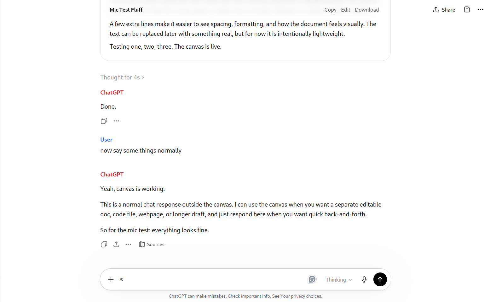

# OpenAI Files Theme

this is just a gimmick repo. i didnt do any testing or anything. just thought it'd be a fun theme. its a kimi one shot so i cant promise stability.

## Features

- **Centered layout** — both user and assistant messages are centered in the same column
- **Color-coded labels** — blue "User" and red "ChatGPT" labels above each message
- **Bubble stripping** — removes the dark user message bubble for a clean text-only look
- **Light mode enforced** — ensures consistent white background and black text regardless of system theme

## Screenshot

## Installation

1. Clone or download this repo
2. Open Chrome/Edge → `chrome://extensions`
3. Enable **Developer mode**
4. Click **Load unpacked**
5. Select the `openai-files-theme` folder
6. Refresh ChatGPT
